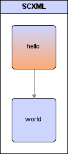

# Getting started
## Prerequisites
To build scxmlcc, you will need:
 * The boost library
 * Basic build tools

On Ubuntu, install these with e.g. apt-get:
```
sudo apt-get install build-essential libboost-all-dev autorevision
```
## Optaining And Building scxmlcc
scxmlcc is available as compressed releases or directly using SVN. The latest and previous releases is available at [Download].

To optain scxmlcc using SVN, see the https://code.google.com/p/scxmlcc/source/checkout Source tab.

To build scxmlcc, simply execute make:
```
cd src
make
```
If you also want to build the examples:
```
cd examples
make
```
## The Examples
This sections describes the examples which can be found at src/examples.
### Hello World
This is really not a practical state machine. It is just a simple expample for getting started with scxmlcc. This statechart is drawn in [https://code.google.com/p/scxmlgui/ scxmlgui], just two states connected with an unconditional transition. 



scxmlgui stores this as the following scxml:

```
<scxml initial="hello" version="0.9" xmlns="http://www.w3.org/2005/07/scxml">
 <state id="hello">
  <transition target="world"></transition>
 </state>
 <state id="world"></state>
</scxml>
```

This statechart can be compiled to an .h file using scxmlcc:
```
scxmlcc -o hello_world.h hello_world.scxml
```

This will generate hello_world.h which contains a sc_hello_world class implementing the statechart. For further detalis about this construct, see [Implementation].

Custom actions can be added to this statechart in C++ by specializing members in the sc_hello_world class. For example, consider the hello_world.cpp example which specializes the enter action on both states and instantiates the state machine:
```
#include "hello_world.h"
#include <iostream>

using namespace std;

typedef sc_hello_world sc;

template<> void sc::state_actions<sc::state_hello>::enter(sc::data_model &m)
{
	cout << "hello" << endl;	
}

template<> void sc::state_actions<sc::state_world>::enter(sc::data_model &m)
{
	cout << "world" << endl;	
}

int main(int argc, char *argv[])
{
	sc sc0;
	return 0;
}
```
As expected, this will output the hello world words:
```
hello
world
```
Note that, as stated on the [https://code.google.com/p/scxmlcc/ Home] page, no external libraries is nedded, and zero code is generated for the non specialized actions making it an efficient implementation.
### Timer Switch
This example implements a simple timer switch:


The idea is that the switch can be turned on or off by sending a button event to the state machine. In the on state the state machine also returns to the off state after a timeout. 
In the on state, a timer event counts up a timer value. The unconditional event from on to off then have a condition, so it will be executed when this timer value is >= 5. Finaly, the off state will reset the timer value to 0.

The dotted timer transition means that it is a transition without target. This means that the on state's enter/exit actions won't be executed on timer events, as opposed to if the transition had target.

These actions implement this in timer_switch.cpp as:
```
template<> void sc::state_actions<sc::state_on>::enter(sc::data_model &m)
{
	cout << "on" << endl;	
}

template<> void sc::state_actions<sc::state_off>::enter(sc::data_model &m)
{
	cout << "off" << endl;	
	m.user->timer = 0;
}

template<> bool sc::transition_actions<&sc::state::unconditional, sc::state_on, sc::state_off>::condition(sc::data_model &m)
{
	return m.user->timer >= 5;
}

template<> void sc::transition_actions<&sc::state::event_timer, sc::state_on>::enter(sc::data_model &m)
{
	++m.user->timer;
}
```

For this to work, a data model must be defined containing the timer variable. The generated state machine class has a user_model struct forward declaration, so a custom data model can be defined. This is done by defining user_model:
```
struct sc::user_model 
{
	int timer;
};
```

The state machine stores this struct in an auto pointer, declared as user_model_p. Thus the model is automatically destructed and deleted, when the state machine is destructed. The custom data model can be constructed and passed to the state machine's constructor as:
```
sc::user_model_p m(new sc::user_model);
sc sc(m);
```

For the full example source, see timer_switch.cpp.
